# Dean Schwartz - Periodic Tables Project

This is an app for a mock company Periodic Tables. In is intended to be used by the staff when they get a call from a customer to reserve a table. In this application you can create a reservation, create a new table, search for reservations by phone number, seat a reservation at a valid table, finish a table when the customer is done, and cancel or edit reservations.

# Links
Front End Link: https://periodic-tables-front-end-dean.herokuapp.com/  
Back End Link: https://periodic-tables-back-end-dean.herokuapp.com/  
# React Application

## `/dashboard` And `/dashboard?date=YYYY-MM-DD` - Home Page

This page displays the reservations for a specific date as well as displaying all tables. The default date if no date is given is the current date.

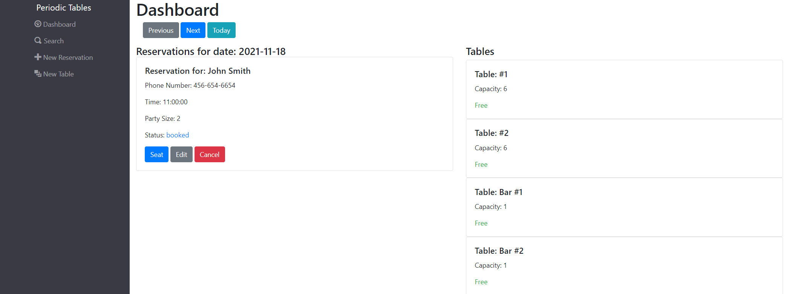

## `/search`

This page allows the user to search for a reservation by phone number either partial or full phone number then shows a list of matching reservations.

### Search Page Before Search

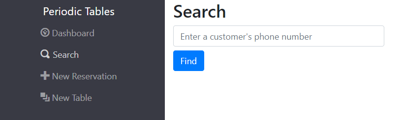

### Search Page After Search

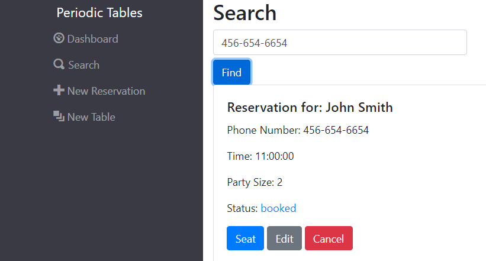

## `/reservations/new`

This route displays a form that allows the user to create a new reservation.

Once a new reservation has been submitted successfully it will redirect to the dashboard/`date of new reservation` displaying the new reservation and all other reservations for that date.

### New Reservation Form Before Submit

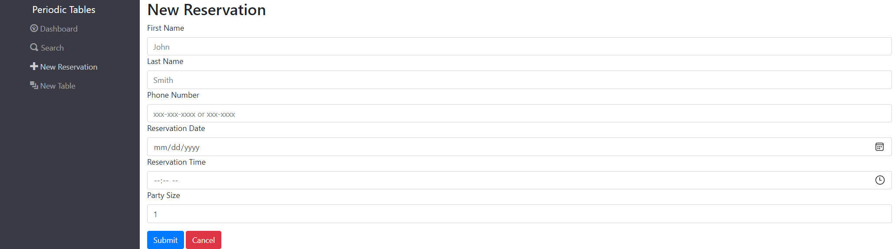

### Dashboard With New Reservation After Submit

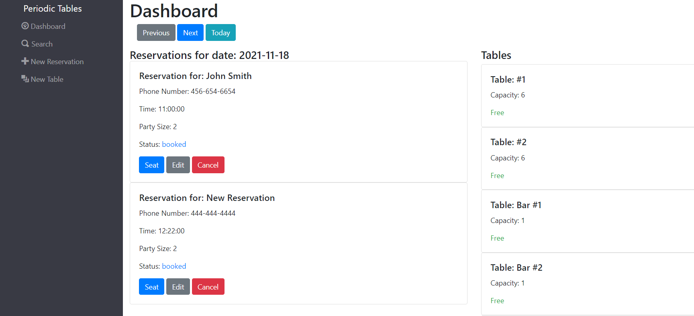

## `/reservations/:reservation_id/edit`

This route is called by clicking edit on an existing reservation that has the status booked (no other status can be edited). Once edit is clicked it goes to a form identical to the new reservation form but with current values filled in. When successfully submitted the form redirects to the dashboard/`date of reservation`.

### Edit Button Dashboard

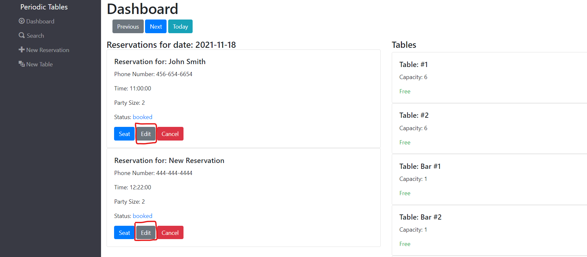

### Edit Reservation Before Submit

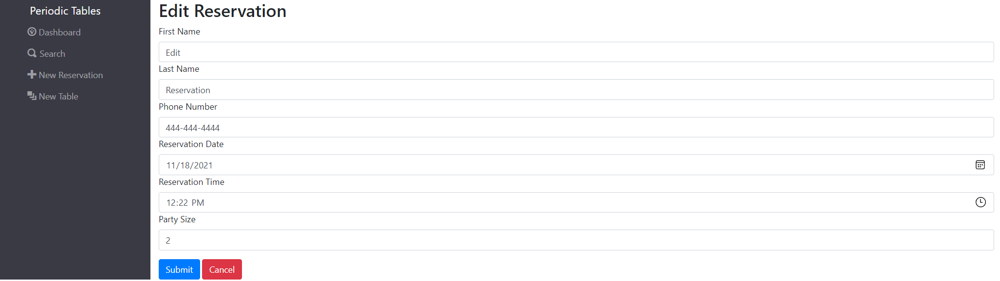

### Dashboard After Submit

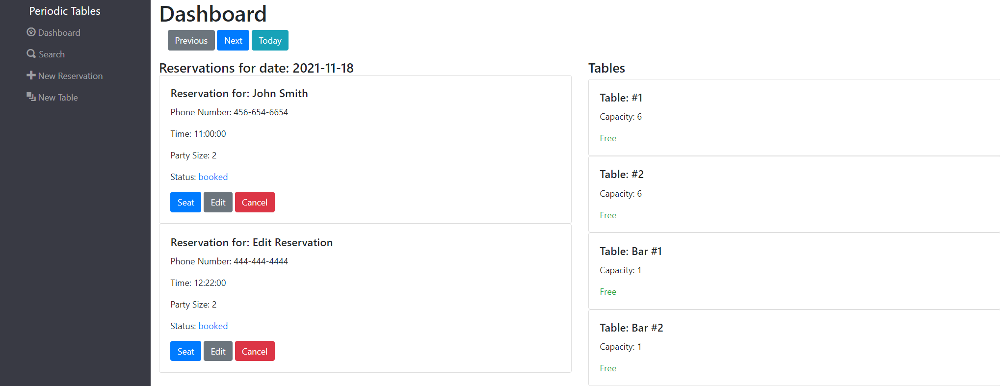

## `/reservations/:reservation_id/seat`

This route is called by clicking seat on an existing reservation that has the status booked (no other status can be seated). Displays a form to assign a reservation a table. After the form is successfully submitted it redirects to dashboard. After a table has been seated the table should show occupied and display a finish button that when clicked finishes the reservation (which hides the reservation) then changes table's status to free.

### Seat Button Dashboard

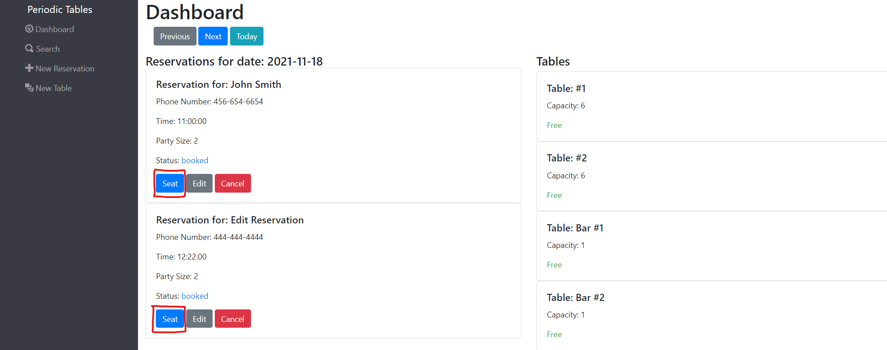

### Seat Button Before Submit

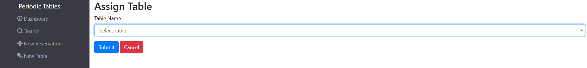

### Seat Button After Submit


### Finish Button Dashboard


## `/tables/new`

This route displays a form to create a new table.

Once a new table has been submitted successfully it will redirect to the dashboard/`current-date` displaying the new table .

### New Table Before Submit

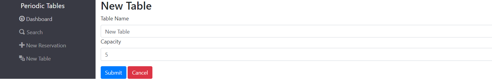

### Dashboard After Submit

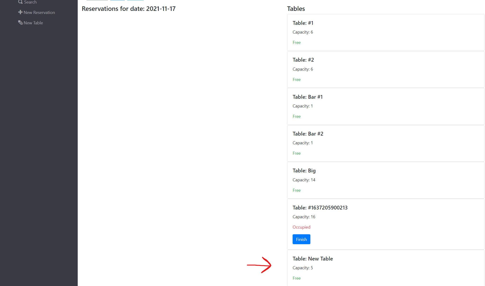

# API Documentation

## `/reservations`

<hr>

### GET: `?date=YYYY-MM-DD`

Returns a list of reservations made for that date.

### GET: `?mobile_number={some-number}` full or partial phone number

Returns a list of reservations that at least partially match the number query.

<i>Shape of response.data from both requests above:</i>

```
[
    {
        reservation_id: 22,
        first_name: "Dean",
        last_name: "Schwartz",
        mobile_number: "444-444-4444",
        reservation_date: "2021-11-20",
        reservation_time: "12:30",
        people: 2,
        status: "booked"
    },
    {
        reservation_id: 23,
        first_name: "John",
        last_name: "Smith",
        mobile_number: "123-456-7890",
        reservation_date: "2022-03-16",
        reservation_time: "21:00",
        people: 5,
        status: "booked"
    },
]
```

### POST

A request body is needed for this route. The body of your request should look like this:

```
request: {
    body: {
        data: {
            first_name: "Barry",
            last_name: "Bonds",
            mobile_number: "321-321-0215",
            reservation_date: "2025-06-25",
            reservation_time: "13:30",
            people: 4,
            status: "booked"
        }
    }
}
```

### All requests that send a reservation object will have data validation to pass.<br>

- First name and last name have no constraints.
- The mobile number must be in hyphenated format. xxx-xxxx or xxx-xxx-xxxx.
- Date must be in the format YYYY-MM-DD. Also, the date must occur either on the current day or in the future.
- The time must be in 24H (HH:MM) format. Also, if the date property is on today's date, the time must not have passed on that day when the request is made.
- People must be an integer greater than 0.

Returns status 201 and the created reservation object.<br><br>

## `/reservations/:reservation_id`

<hr>

### GET

If the reservation defined in the request URL exists, it returns the reservation object.

```
{
    reservation_id: 7,
    first_name: "Crisitano",
    last_name: "Ronaldo",
    mobile_number: "998-561-5563",
    reservation_date: "2022-03-12",
    reservation_time: "11:30",
    people: 2,
    status: "booked"
}
```

### PUT

A request body is needed. The body of the request should resemble:

```
data: {
    first_name: "Jack",
    last_name: "Black",
    mobile_number: "223-321-0245",
    reservation_date: "2021-07-26",
    reservation_time: "18:00",
    people: 2,
    status: "booked"
}
```

Returns status 200 and the updated reservation.<br><br>

## `/reservations/:reservation_id/status`

<hr>

### PUT

The body of the request must resemble:

```
data: { status: "booked" }
```

Returns status 200 and the updated reservation object.
<br><br>

## `/tables`

<hr>

### GET

Returns a list of all tables in the database.

```
[
  {
    table_id: 12,
    table_name: "Bar #1",
    capacity: 2,
    reservation_id: null
  },
  {
    table_id: 13,
    table_name: "Bar #2",
    capacity: 4,
    reservation_id: 7
  },
  ...
]
```

### POST

Body of the request must resemble:

```
data : {
    table_name: "#7",
    capacity: 6,
    reservation_id: 12
}
```

- table_name does not need to include a # sign, but it must be a string greater than one character.
- capacity must be an integer greater than 0.
- reservation_id is optional, but if one is passed, it must be the ID of a reservation that does exist in the database.

Returns 201 and the created table.
<br><br>

## `/tables/:table_id`

<hr>

### GET

If the table defined in the request URL exists, it returns the table object.
Response looks like:

```
data: {
    table_id: 12,
    table_name: "Bar #4",
    capacity: 4,
    reservation_id: null
}
```

<br>

## `/tables/:table_id/seat`

<hr>

### PUT

If the table_id passed in the parameters exists, the reservation_id passed in the body exists, and the table is currently not occupied as well as the reservation belonging to the reservation_id is only booked, and not seated, finished, or cancelled: the table will be updated with the reservation_id passed.<br>

Request body looks like this:

```
data: { reservation_id: 12 }
```

When the table is updated with a reservation_id, that means the reservation is now seated at a table. Accordingly, the reservation's status will also be updated to reflect its "seated" status.<br>
Returns status 200 and the updated <i>reservation</i>, not the table.

```
data: {
    reservation_id: 5,
    first_name: "Jack",
    last_name: "White",
    mobile_number: "981-123-4567",
    reservation_date: "2007-04-20",
    reservation_time: "18:00",
    people: 6,
    status: "seated"
}
```

### DELETE

If the table exists, and the table has a reservation_id property that is not null or undefined, the table's reservation_id property will be nullified.

Returns status 200 and the updated reservation object associated with the change to the table.

```
data: {
    reservation_id: 62,
    first_name: "John",
    last_name: "Smith",
    mobile_number: "505-737-4253",
    reservation_date: "2030-09-25",
    reservation_time: "14:00",
    people: 1,
    status: "finished"
}
```

<br>

# Installation Instructions

In order to effectively install and use this application locally, you will need to either clone the repo or download the zip. You will then need to navigate to the top level of the project in your bash terminal and:

1. run `npm i`
2. `cd front-end && npm i`
3. `cd ../back-end && npm i`

Now that you have all of the scripts installed, you will need two different PostgreSQL database instances to either run the application locally or test it.

You must make a `.env` file in both the front-end and back-end directories.

Load the back-end `.env` file with two environment variables with the values of your two database URLs like so:

```
DATABASE_URL_TEST=test-data-base-url-goes-here
DATABASE_URL_DEVELOPMENT=development-data-base-url-goes-here
```

In the front-end `.env` file, enter:

```
REACT_APP_API_BASE_URL=http://localhost:5000
```

Now you will need to migrate the tables to the development database. Don't bother doing it for the test database, though. The tests are carrying that out for you each time. From the back-end folder:

1. `npx knex migrate:latest`
2. `npx knex seed:run`

Now you are ready to run the server locally. From the top level of the project, run `npm run start:dev` if you would like to run the server and application.

If you would like to test the application, you can view the `package.json` files and use the testing scripts provided there. Unfortunately, some of the provided testing scripts do not function. However, the ones that certainly do are:

1. all of those that are structured like `test:5:backend` or `test:3:frontend`
2. `test:frontend` and `test:backend`
